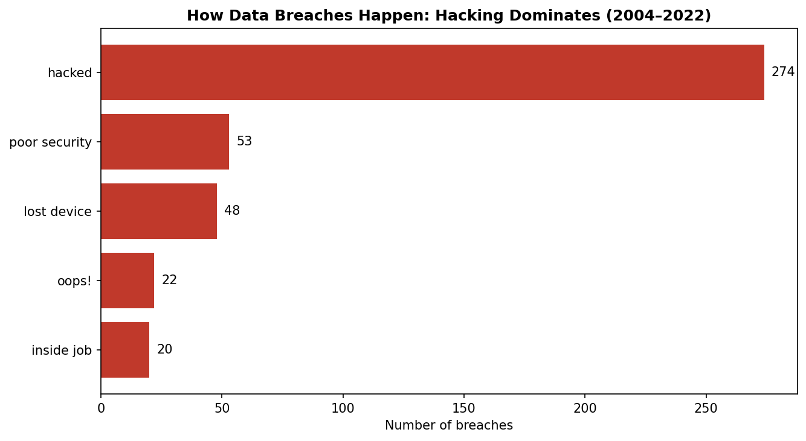
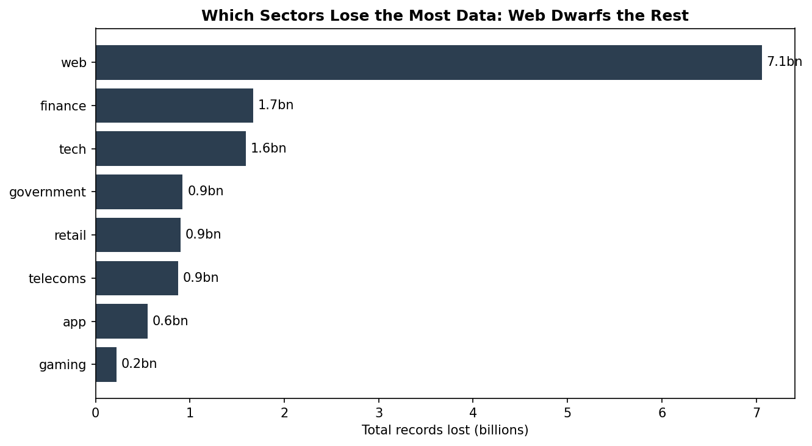
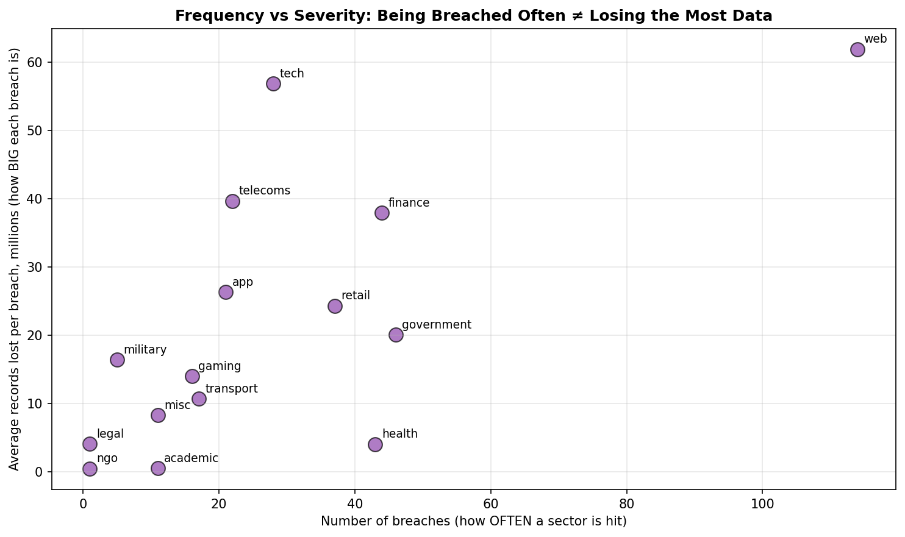
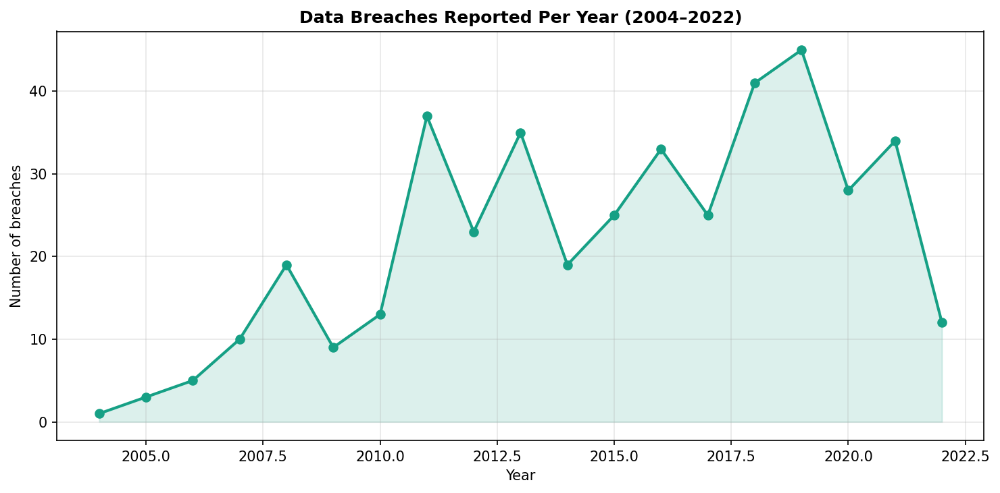

# Data Breaches Analysis: Causes, Severity & Sector Patterns (2004–2022)

An end-to-end analysis of 417 of the world's biggest reported data breaches, examining how breaches happen, which sectors are hit hardest, and the difference between how *often* a sector is breached and how *much* data it loses.

**Tools used:** Python (pandas, matplotlib)

---

## The Question

> **What are the most common causes and severity patterns of reported data breaches, and are certain sectors hit harder than others?**

Data breaches are usually reported one at a time in the news, which makes it hard to see the bigger picture. This project steps back and looks at the patterns across nearly two decades of major breaches: what causes them, which sectors suffer most, and whether the sectors breached most *frequently* are the same ones that lose the most *data*.

---

## Key Findings

**1. Hacking is by far the most common cause.**
Of the five breach methods in the data, **hacking accounts for 65.7%** of all breaches — nearly two in three. Everything else trails far behind: poor security (12.7%), lost/stolen devices (11.5%), accidental disclosure ("oops!", 5.3%), and inside jobs (4.8%). Deliberate external attacks, not accidents or insiders, drive the majority of breaches.

**2. The web sector loses more data than every other sector combined.**
The web sector lost around **7.1 billion records** across the period — more than the next four sectors (finance, tech, government, retail) put together. Finance (1.7bn) and tech (1.6bn) are a distant second and third.

**3. Being breached often is not the same as losing the most data.**
This is the most important insight. Some sectors are breached *frequently* but lose relatively little each time, while others are breached *rarely* but catastrophically:

- **Health** — breached often (43 times) but only ~4 million records per breach on average. Frequent but contained.
- **Tech** — breached far less often (28 times) but ~57 million records per breach on average. Rare but devastating.
- **Web** — worst on both measures: breached most often *and* huge average breach size.

**4. Reported breaches rose steadily to a peak around 2019.**
The number of reported breaches grew from near-zero in 2004 to a peak of around 45 in 2019.

---

## Method

1. **Data source** — The "World's Biggest Data Breaches & Hacks" dataset (Information is Beautiful), covering major breaches of 30,000+ records from 2004 to 2022.
2. **Cleaning (Python / pandas):**
   - Removed a non-data legend/instructions row from the top of the file.
   - Stripped hidden trailing spaces from column names (e.g. `"year   "`) that prevented columns being selected.
   - Converted `records lost` from text with commas (e.g. `"15,000,000"`) into true numeric values.
   - Standardised sector labels: stripped spaces, lowercased, merged duplicates (`financial` → `finance`), and reduced multi-sector entries (e.g. `"tech, web"`) to their primary sector.
   - Cleaned method labels the same way, resolving space-based duplicates.
3. **Analysis** — Grouped by method to find the most common causes, and by sector to compare breach frequency against total and average records lost.
4. **Visualisation (matplotlib)** — Built four charts: breach methods, sectors by total records lost, a frequency-vs-severity scatter, and a time trend.

---

## Files in this Repository

| File | Description |
|---|---|
| `breaches_analysis.ipynb` | The Python notebook: cleaning, analysis, and charts |
| `breaches_clean.csv` | The fully cleaned dataset |
| `breaches_by_method.csv` | Breach counts by method |
| `breaches_by_sector.csv` | Sector breakdown: breaches and records lost |
| `breaches_by_year.csv` | Breaches per year |
| `chart1_methods.png` … `chart4_breaches_over_time.png` | The four visualisations |

---

## Notes and Limitations

- **The data runs to 2022.** The apparent sharp drop in breaches in 2021–2022 is almost certainly a **data artifact**, not a real decline: recent breaches take time to surface, be verified, and be added to the dataset, so the most recent years are under-counted rather than genuinely lower.
- **Only breaches of 30,000+ records are included.** Countless smaller breaches occur continually and are not represented here, so this is a view of *major* breaches specifically.
- **Record counts are as reported.** Some figures are estimates or were revised after disclosure; a few "unknown" breaches are approximated in the source.
- **Multi-sector breaches were reduced to a single primary sector** for clean grouping, which slightly simplifies a small number of cross-sector cases.

---

## What I'd Do Next

- **Extend the data to the present** using the UK Government's *Cyber Security Breaches Survey* or a current breach feed, to bring the trend up to date and remove the recency gap.
- **Analyse breach method by sector** — e.g. is health more prone to lost devices, while web is almost entirely hacking? This would connect findings 1 and 3.
- **Bring in the data-sensitivity rating** already present in the dataset to weight breaches by how damaging the exposed data is, not just how many records were lost.
- **Look at breach method over time** to see whether hacking has grown as a share of breaches as older causes (lost devices, accidental disclosure) have declined.

---

## Data Source

**Original data:** *World's Biggest Data Breaches & Hacks* — Information is Beautiful.
https://informationisbeautiful.net/visualizations/worlds-biggest-data-breaches-hacks/

**Dataset accessed via:** Kaggle — "World's Biggest Data Breaches and Hacks" (joebeachcapital), a CSV export of the Information is Beautiful visualisation.
https://www.kaggle.com/datasets/joebeachcapital/worlds-biggest-data-breaches-and-hacks

*This analysis uses publicly available data and is intended as a portfolio demonstration of data cleaning, analysis, and visualisation.*
